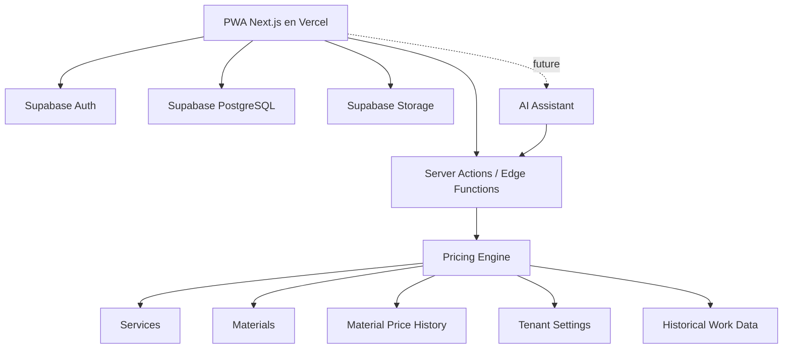

# Architecture

Aplicación: **SewQuote** — PWA SaaS de presupuestos para confección.

## Arquitectura propuesta

Hosting MVP: Vercel (free tier) + Supabase Free. Costo objetivo $0 — ver `deployment.md` y ADR-003.



## Frontend
- Next.js (App Router).
- TypeScript.
- Tailwind CSS.
- Design tokens y pantallas base: `design.md` + prototipo en `docs/stitch_sewquote_atelier_management_saas/` (adaptado; no literal).
- PWA (manifest + service worker básico).
- Formularios con validación.
- UI mobile-first.
- i18n: español y portugués brasileño desde el MVP (sin hardcodear textos/moneda/fechas).

## Backend
Supabase será la plataforma inicial:
- PostgreSQL.
- Auth.
- Storage.
- RLS (aislamiento por `tenant_id` en toda tabla de negocio).
- Edge Functions cuando se requiera ejecución server-side que no entre en Server Actions.

## Módulos del dominio
Monolito modular sobre Next.js + Supabase. Separar en el código:

| Módulo | Responsabilidad |
|--------|-----------------|
| auth | registro, sesión, recuperación |
| tenants | configuración del negocio (moneda, idioma, tz, tarifa, margen, factores, categorías) |
| clients | clientes y personas destinatarias |
| catalog | servicios, materiales, historial de precios, categorías de trabajo |
| pricing | motor determinístico de cálculo (dominio puro, sin UI) |
| quotes | presupuestos, trabajos/piezas, snapshots, estados, versiones, caducidad |
| work-orders | órdenes de producción, estados, resultado real |
| analytics | histórico y futuras recomendaciones (V2) |
| measurements | historial de medidas + snapshot en trabajo (incluida en esta versión) |

## Dominio
El pricing engine debe ser independiente de la UI y testeable como unidad.

Conceptualmente:

```text
QuoteInput
   ↓
Validation (tenant, cantidades, estados)
   ↓
Material resolution (precio vigente → snapshot al guardar)
   ↓
Labor calculation (fijo | horas × tarifa)
   ↓
Complexity
   ↓
Urgency
   ↓
Additional costs
   ↓
Margin
   ↓
QuoteCalculation (desglose + suggestedPrice)
```

Reglas:
- La UI no contiene la lógica definitiva de precios.
- El servidor resuelve precios y configuración; no confiar en montos enviados por el cliente para operaciones definitivas.
- La IA (V2) solo produce `QuoteInput` estructurado; nunca el precio.

## Presupuestos y versiones
- Un presupuesto contiene N trabajos/piezas (cada uno con categoría).
- Snapshot de materiales y, si aplica, de medidas al guardar.
- Versiones formales: envío, aprobación, recálculo por vencimiento.
- Vencido: marcar, no recalcular en segundo plano.

## Enlace público
Incluido en esta versión (REQ-026): ruta `/orcamento/[token]` con token opaco de solo lectura + endpoint de aprobación; sin exponer RLS del tenant. Mínimos datos: quote enviada/aprobada, sin PII innecesaria de otros registros.

## Escalabilidad
Inicialmente no se necesita microservicios. Un monolito modular sobre Next.js + Supabase es suficiente para el MVP con un cliente de testing y evolución a multi-tenant real.

## Restricciones free tier (ADR-003)
- Requests serverless cortas: pricing síncrono y ligero.
- DB compacta (~500 MB): logs ligeros, sin tablas de auditoría infladas en exceso.
- Storage ~1 GB: optimizar imágenes antes de subir.
- Staging puede ser el 2.º proyecto Supabase o saltarse al inicio; producción aislada.

## Fuera de alcance de esta fase
- Microservicios, colas pesadas, búsqueda vectorial.
- Provider de IA concreto (V2).
- Webhooks de pagos (fuera de MVP).
